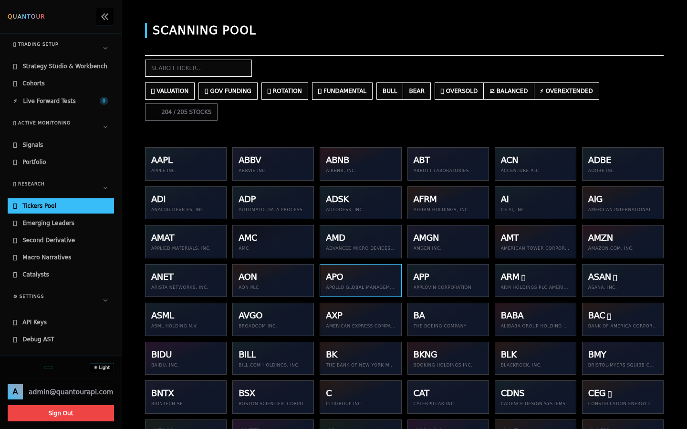
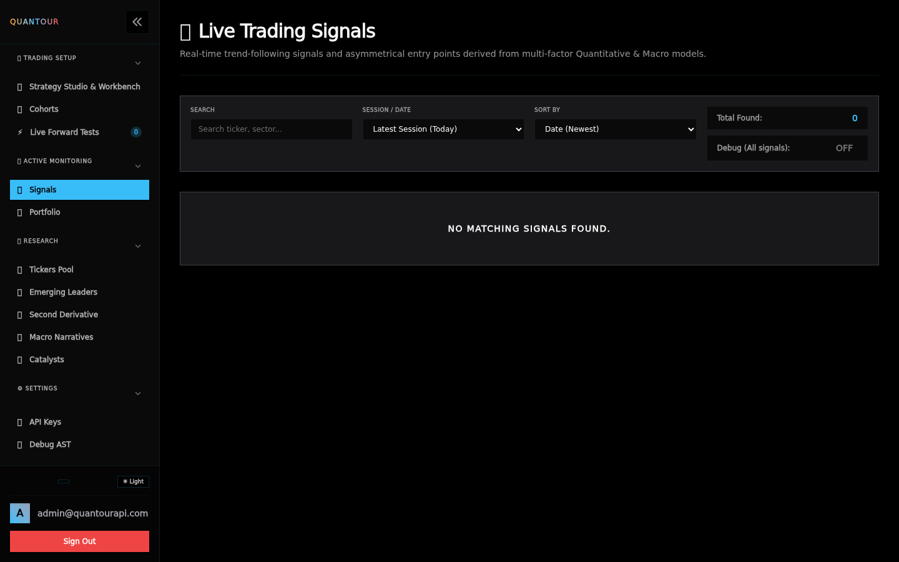
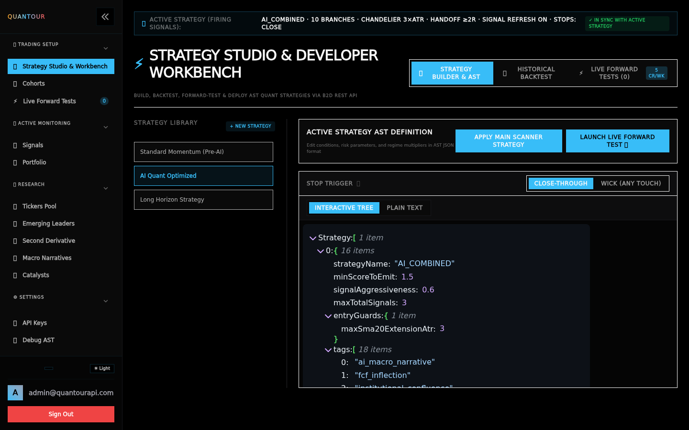
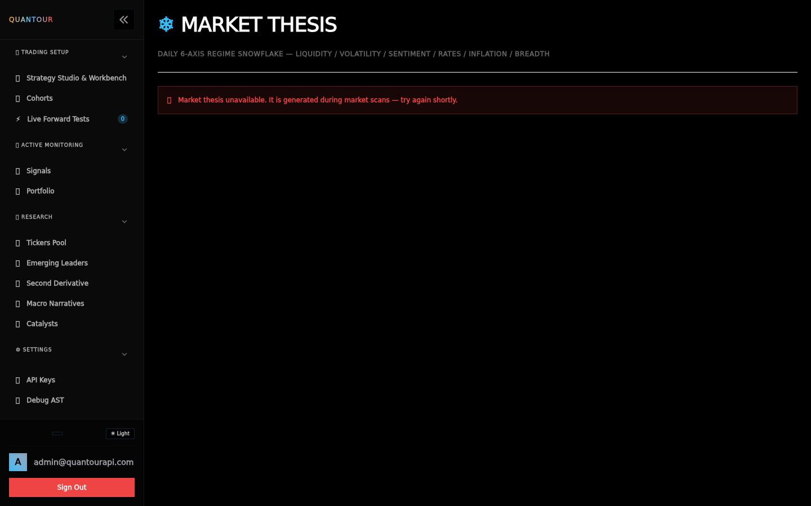
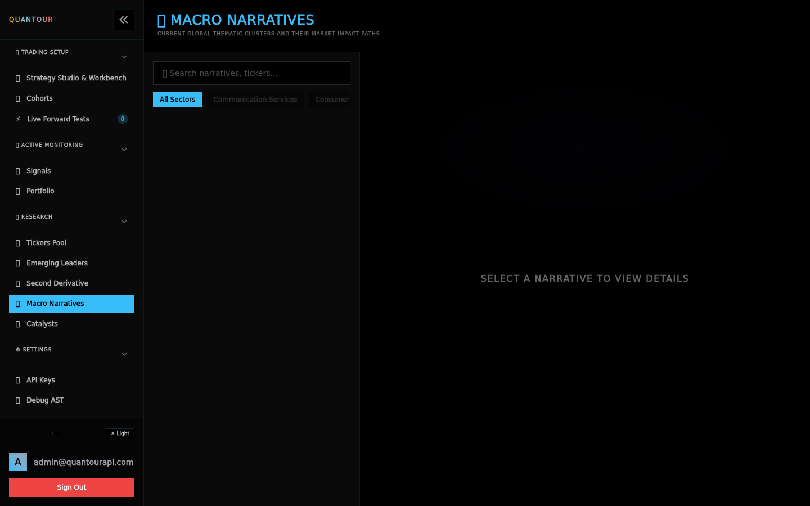

# Quantour Clients — the self-hosted signal suite

Everything below runs on **your machine**, under **your** Quantour API key:
a web dashboard, a Telegram bot, and the local API proxy that unifies them
into one portfolio. One key in, every device and chat in sync.

[Get running in 5 minutes](https://github.com/admin-quantourapi/quantourapi-clients#quick-start){: .btn .btn-primary .mr-2 }
[Why it's built this way](architecture.md){: .btn }

*(All screenshots are from a stock install running the demo environment.)*

---

## The dashboard

**One view of your whole book**: scores, signals, and the market state that
drives them — every number carries its provenance, nothing fabricated.

### Signals, curated by YOUR strategy

Raw setups come from the Quantour engine; **your** strategy AST decides which
fire, how they group, and how many you see. No black box — the strategy
builder shows every branch.

### FCF screener & tickers

Free-cash-flow inflection views, sector cohorts, and per-ticker deep dives
with macro-event and supply-chain connections.

### Strategy builder (bring your own edge)

Compose strategies as ASTs: entry branches with risk profiles, entry guards,
exit philosophy (harvest vs let-runners-run), and the aggressiveness dial
that trades score-ranking against diversification — then forward-test them.

### Market thesis radar

A six-axis regime radar (liquidity, volatility, sentiment, rates, inflation,
breadth) derived from live market snapshots — current conditions, not
forecasts.

### Macro narratives

Track which narratives are rotating, decaying, or accelerating — and which
tickers they expose. Catalysts and second-derivative supply chains included.

---

## The Telegram bot

The same portfolio, in your pocket: `/scan`, `/top`, `/analyze`, `/status`,
`/report` (the daily wrap), budget commands — and **tighten-only stop
maintenance**: when a held position gets a fresh signal, stops move up and a
*"Why did they move?"* button explains exactly which signal branch drove the
change. Full command surface: [Telegram guide](telegram.md).

## The Client API

The quiet backbone: local SQLite store, one linked key, the client-side
scanner, and a clean HTTP surface for **your own code**. Every device —
dashboard, bot, scripts — shares one portfolio through it.

---

## Operator's manual

| Page | What it covers |
|------|----------------|
| [Configuration](configuration.md) | Every environment variable, per app, with defaults |
| [Architecture](architecture.md) | Components, ports, the WebSocket gateway protocol, identity model |
| [Telegram bot](telegram.md) | Command surface, the `/link` flow, multi-chat behavior |
| [Operations](operations.md) | Upgrades, backups, health checks |
| [Troubleshooting](troubleshooting.md) | The failure classes you'll actually hit |

For marketing, pricing, and the API product: **[quantourapi.com](https://quantourapi.com)**.
For agent-driven installs: **[QUANTOUR_AGENT.md](https://quantourapi.com/QUANTOUR_AGENT.md)**.
